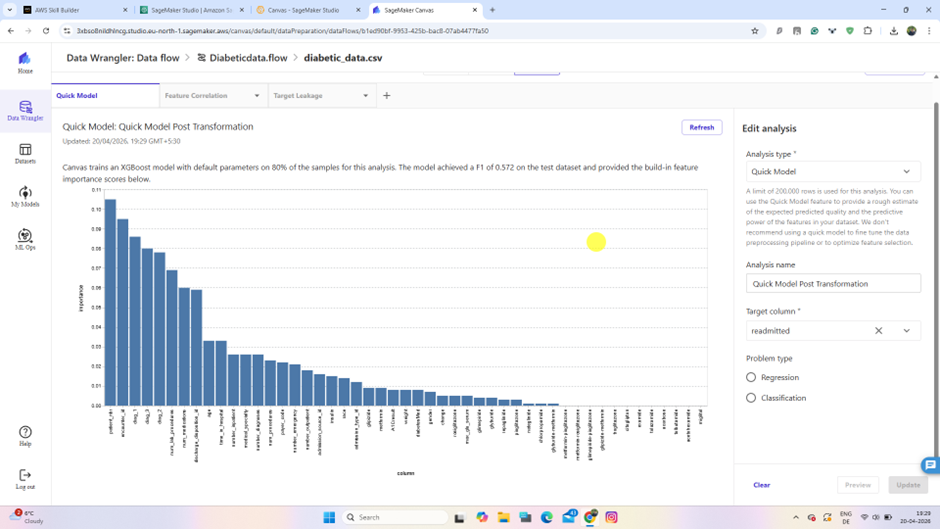
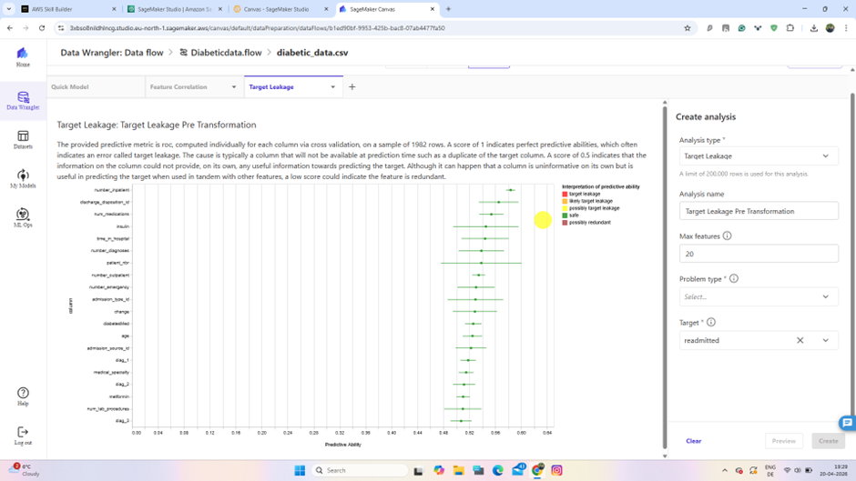
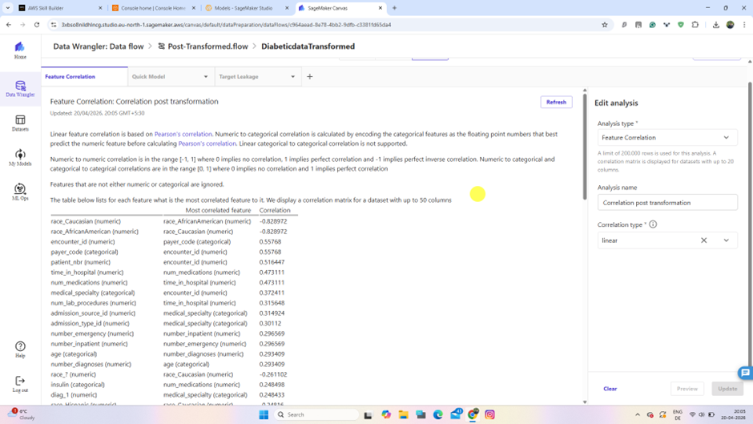
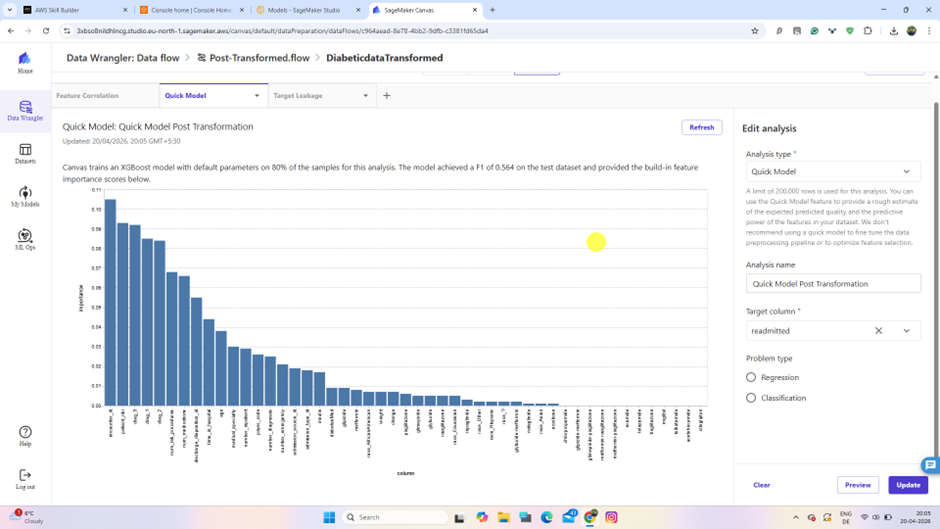
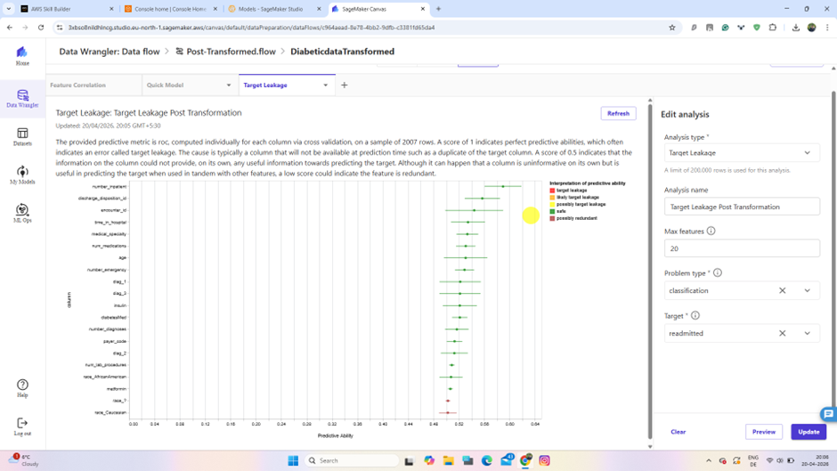
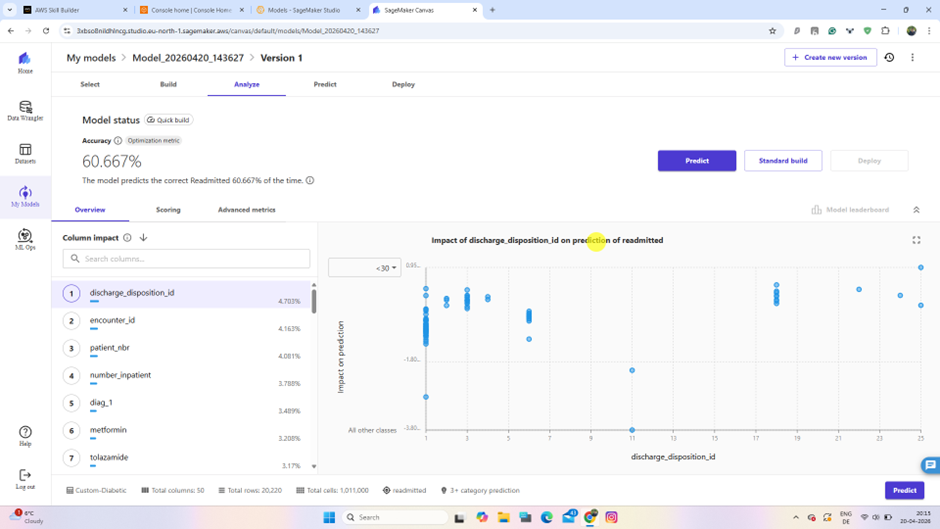
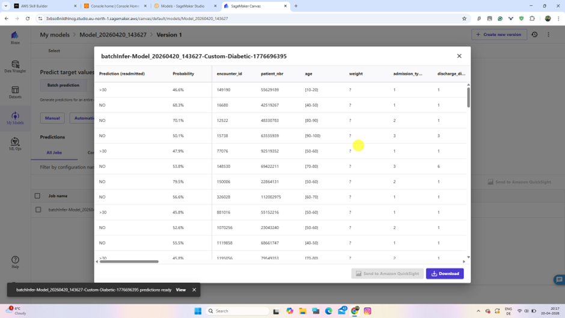

# Diabetic Patient Readmission Analysis with Amazon SageMaker Canvas

This project demonstrates a low-code machine learning workflow for analyzing and predicting **30-day hospital readmission risk** for diabetic patients using **Amazon SageMaker Canvas** and **Data Wrangler**. The main focus of this project is **exploratory data analysis (EDA), visual analysis, feature engineering, and transformation validation**, followed by a custom predictive model. 

> **Note:** In my actual implementation, I **uploaded the dataset files directly into SageMaker Canvas** instead of importing them from Amazon S3, and I **exported the transformed data to a SageMaker dataset** instead of exporting it back to S3.

---

## Project Overview

Hospital readmission is a major healthcare quality and cost concern, especially for chronic conditions such as diabetes. This project uses a clinical care dataset containing **10 years of diabetic patient records (1999–2008)** from **130 US hospitals and integrated delivery networks** to study the factors associated with patient readmission within **30 days of discharge**.

The objective of this capstone was to:

- Perform **exploratory data analysis** on the diabetes dataset
- Use **visual analysis tools** in SageMaker Data Wrangler
- Apply **feature engineering and preprocessing**
- Compare pre-transformation and post-transformation data behavior
- Build a **custom machine learning model** in SageMaker Canvas
- Generate **batch predictions** for readmission risk

---

## Problem Statement

The goal of this project is to identify the factors contributing to the **high readmission rate of diabetic patients within 30 days post-discharge** and build a model that predicts which patients are more likely to be readmitted.

This is important because:

- Readmission is a key indicator of healthcare quality
- Diabetes is strongly associated with repeated hospitalization
- Better prediction can support earlier intervention and improved discharge planning
- Reducing readmission can lower healthcare costs and improve patient outcomes

---

## Dataset

The project uses the following files:

- `diabetic_data.csv`
- `IDS_mapping.csv`

These datasets include hospital encounter information such as:

- Patient demographics
- Admission and discharge details
- Number of medications
- Number of procedures
- Lab-related information
- Diagnosis counts
- Visit history
- Readmission outcome

Each row represents a hospital encounter for a diabetic patient who stayed for up to 14 days.

---

## Tools Used

- **Amazon SageMaker Canvas**
- **Amazon SageMaker Data Wrangler**
- **Quick Model analysis**
- **Feature Correlation analysis**
- **Target Leakage analysis**
- **Low-code AutoML custom model building**
- **GitHub** for documentation

---

## Workflow

### 1. Data Upload
Instead of importing data from an S3 bucket, I uploaded the CSV files directly into **SageMaker Canvas**.

```text
Input files:
- diabetic_data.csv
- IDS_mapping.csv
```


---

### 2. Data Flow Creation
A new Data Wrangler flow was created to prepare and analyze the dataset.

```text
Data flow name: DiabeticData
```


---

### 3. Initial Data Inspection
After loading the dataset, SageMaker Canvas automatically detected the column data types and displayed distributions and histograms for the variables.

This helped in:
- understanding feature structure,
- identifying categorical and numerical variables,
- spotting possible data quality issues,
- and preparing for downstream visual analysis.


---

## Exploratory Data Analysis

The most important part of this project was the **visual data analysis** stage in SageMaker Data Wrangler. This stage provided early insight into feature relationships, predictive signals, redundancy, and transformation needs.

### Feature Correlation Analysis

A **linear feature correlation analysis** was created on the raw dataset to examine relationships between variables.

```text
Analysis name: Feature Correlation Linear Pre-Transformation
Correlation type: Linear
```

This analysis was used to:
- detect multicollinearity,
- identify redundant columns,
- and understand how strongly variables were associated.

### Key observations
The analysis showed that **no feature pairs exceeded the recommended correlation threshold of 0.90**, so there was no major multicollinearity issue.

The most correlated feature pairs observed were:

- `num_procedures` and `num_medications` → ~0.481
- `num_medications` and `time_in_hospital` → ~0.476
- `number_diagnoses` and `age` → ~0.340

### Interpretation
These relationships suggest that:
- patients with more procedures often received more medications,
- longer stays were associated with more medication use,
- and older patients tended to have more diagnoses recorded.


---

### Quick Model Analysis

A **Quick Model** was run on the raw dataset using `readmitted` as the target column.

```text
Analysis name: Quick Model Pre-Transformation
Target column: readmitted
```

This gave a baseline estimate of how predictive the raw dataset was before further preprocessing.

### Result
- **Baseline F1 score:** ~0.496

### Top contributing features
- `number_inpatient`
- `patient_nbr`
- `discharge_disposition_id`

### Interpretation
The baseline score was relatively low, which indicated that:
- the raw dataset needed additional preprocessing,
- feature engineering could improve model quality,
- and some raw columns were not contributing effectively.

This was an important checkpoint because it showed that the original feature set was not strong enough on its own.



---

### Target Leakage Analysis

A **Target Leakage** analysis was performed to detect whether any feature directly or indirectly exposed the target in a way that would make the model unrealistically strong.

```text
Analysis name: Target Leakage Pre-Transformation
Problem type: Classification
Target: readmitted
```

### Result
- Leakage score was approximately **0.5**

### Interpretation
This suggested that:
- no feature alone was highly predictive in a suspicious way,
- there was no strong evidence of target leakage,
- and the dataset remained valid for predictive modeling.



---

## Feature Engineering

After the initial analysis, transformations were applied to improve the dataset.

### Dropped Columns

The following columns were removed:

- `num_procedures`
- `number_outpatient`
- `A1C_Result`
- `gender`
- `max_glu_serum`

These were dropped based on the capstone workflow and post-analysis reasoning, with the goal of reducing noise and simplifying the feature space.


---

### One-Hot Encoding

The categorical column `race` was transformed using **one-hot encoding**.

```text
Transform: One-hot encode
Column: race
Invalid handling: Keep
Output style: Columns
```

This made the categorical data more suitable for machine learning models.


---

## Export and Re-Analysis

After transformation, I exported the processed data to a **SageMaker dataset** and then used it again for post-transformation validation and analysis.

> This is different from the original transcript, which used S3 export.


---

## Post-Transformation Analysis

To compare the cleaned dataset with the original one, the transformed data was loaded again and sampled.

### Sampling

A random sample of **20,000 rows** was created because Quick Model analysis supports datasets up to that size.

```text
Sampling method: Random
Approximate sample size: 20000
```


---

### Feature Correlation After Transformation

A second feature correlation analysis was performed on the transformed data.

```text
Analysis name: Feature Correlation Linear Post-Transformation
```

This was used to confirm that the dataset structure remained valid after feature engineering.



---

### Quick Model After Transformation

A second Quick Model was created using the transformed dataset.

```text
Analysis name: Quick Model Post-Transformation
Target column: readmitted
```

### Observation
The post-transformation analysis showed a change in feature behavior and contribution patterns. In addition to previous important variables, admission-related features became more influential.

### Notable contributing features
- `number_inpatient`
- `discharge_disposition_id`
- `admission_source_id`
- `admission_type_id`

### Interpretation
This suggests that after preprocessing:
- the dataset became more structured for prediction,
- some admission-related features gained stronger predictive relevance,
- and the feature space better reflected the readmission problem.



---

### Target Leakage After Transformation

A final target leakage analysis was performed on the transformed dataset.

### Result
- Leakage score remained around **0.5**

### Interpretation
This confirmed that the transformed features still did not introduce any obvious leakage into the modeling process.



---

## Custom Model Building

After validating the transformed dataset, a custom model was built in **Amazon SageMaker Canvas**.

```text
Model name: Custom-Diabetics
Problem type: Predictive analysis
Target column: readmitted
Model type: 3+ category
Objective metric: Accuracy
Build type: Quick build
```

### Model Performance
- **Accuracy:** ~60.667%

### Interpretation
The model was able to predict the correct readmission category about 61% of the time. This was acceptable for a quick low-code capstone workflow and showed the value of the preprocessing and analysis stages.



---

## Batch Prediction

The trained model was then used for **batch inference**.

The prediction output added:
- a predicted `readmitted` label,
- and a probability score for the prediction.

This allowed the identification of patients who were more likely to be readmitted and the confidence level of the model’s predictions.



---

## Key Insights

- Visual EDA in SageMaker Data Wrangler helped identify important feature relationships early.
- There was **no severe multicollinearity** in the raw dataset.
- The baseline Quick Model showed **limited predictive power**, highlighting the need for preprocessing.
- Feature engineering changed the contribution of important variables and improved the structure of the data.
- Admission-related and inpatient-history variables appeared to be meaningful predictors of readmission.
- No major target leakage was detected before or after transformation.

---

## Repository Structure

```text
.
├── README.md
├── screenshots/
└── docs/

```

---

## What I Learned

This capstone helped me practice an end-to-end low-code ML workflow with a strong emphasis on **data understanding before modeling**.

### Main takeaways
- How to use **SageMaker Data Wrangler** for visual EDA
- How to evaluate feature relationships using **correlation analysis**
- How to assess baseline predictive quality using **Quick Model**
- How to check for **target leakage**
- How to apply **feature engineering** in a no-code or low-code environment
- How preprocessing affects downstream model performance

The most valuable part of the project was understanding how **data analysis and transformation decisions directly influence ML outcomes**.

---

## Limitations

- The model was built using **Quick Build**, not Standard Build
- Feature engineering was relatively basic
- The workflow was completed in a low-code environment, so advanced custom modeling was not explored
- This project is educational and should not be considered a production-grade clinical prediction system

---

## Future Improvements

- Use **Standard Build** for better model quality
- Explore class imbalance handling
- Perform deeper feature engineering
- Compare binary and multiclass target setups
- Add more detailed model explainability
- Perform misclassification analysis on false positives and false negatives

---

## Author

**Ramakrishna Tikka**

---
